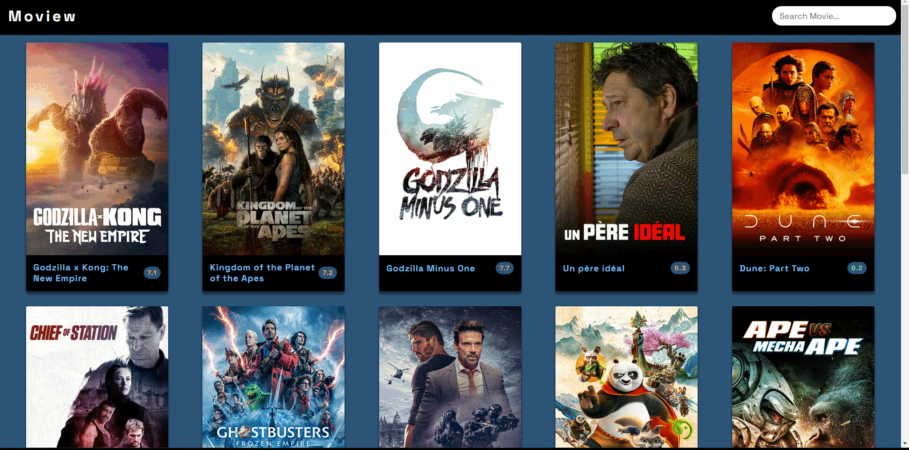

# Movie Website using The Movie DB API

## Description

This is a web application developed using The Movie DB API to display information about movies in a responsive manner.

## Technologies Used

- HTML
- CSS
- JavaScript

## How to Use

1. Clone the repository:
   ```bash
   https://github.com/KamilErdogmus/Moview.git
   ```
2. Open the index.html file in your browser

# GIF



# Link

[Website](https://6647933856a651022208f81c--gleaming-melomakarona-d76bd8.netlify.app/)
